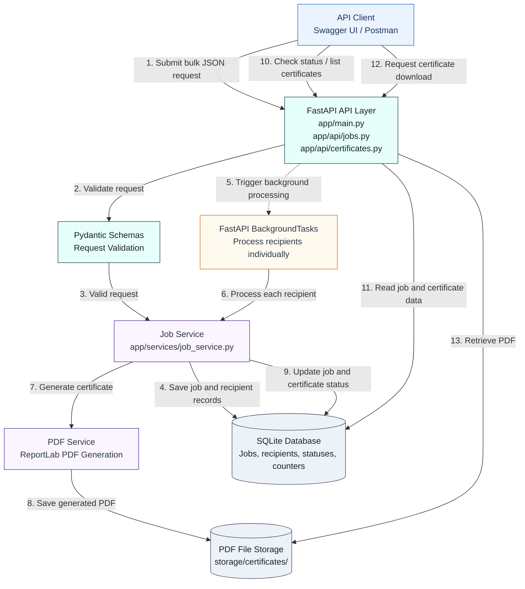

# Bulk Certificate Generator

A simple, internship-ready REST API that generates **one PDF certificate per recipient** from a single bulk request. Submit a job with many recipients, track its progress, and download the generated certificates — one failed recipient never stops the rest.

Built as an internship coding assignment with an emphasis on **clean code, maintainability, simplicity and explainability**.

---

## Table of Contents

1. [Project Overview](#1-project-overview)
2. [Features](#2-features)
3. [Technology Stack](#3-technology-stack)
4. [Architecture](#4-architecture)
5. [Project Structure](#5-project-structure)
6. [Setup Instructions](#6-setup-instructions)
7. [Running the Application](#7-running-the-application)
8. [Running Tests](#8-running-tests)
9. [API Endpoints](#9-api-endpoints)
10. [Example Requests / Responses](#10-example-requests--responses)
11. [Certificate Generation Flow](#11-certificate-generation-flow)
12. [Failure Handling](#12-failure-handling)
13. [Design Decisions](#13-design-decisions)
14. [Why BackgroundTasks](#14-why-backgroundtasks)
15. [Why SQLite Was Chosen](#15-why-sqlite-was-chosen)
16. [Learning](#16-learning)
17. [Future Scope](#17-future-scope)

---

## 1. Project Overview

The **Bulk Certificate Generator** accepts one job containing many recipients, validates the data, generates a professional PDF certificate for each valid recipient using a single predefined ReportLab template, tracks per-recipient and job-level status, and exposes download URLs for every generated PDF.

**Core promise:** submitting a job is fast (the HTTP request returns immediately), processing happens in the background, and a failure while rendering one certificate is *recorded* — never *propagated* — so every other recipient still gets their certificate.

---

## 2. Features

- **Bulk requests** — one job with many recipients in a single API call
- **Strict input validation** — empty names, invalid e-mails, duplicate recipients and malformed dates are rejected with clear `422` errors *before* anything is persisted
- **One predefined certificate template** — clean, professional, landscape A4 design (no template editor)
- **Background processing** — FastAPI `BackgroundTasks`; the request returns in milliseconds
- **Job status & progress** — `QUEUED → PROCESSING → COMPLETED / COMPLETED_WITH_ERRORS / FAILED` with live counters and a `progress` percentage
- **Per-recipient isolation** — each certificate is generated in its own try/except and its own transaction
- **Individual downloads** — every generated PDF has its own download endpoint
- **Persistent tracking** — jobs and results are stored in a relational database (SQLite)
- **Deterministic test suite** — 38 tests covering every required scenario, no external services

---

## 3. Technology Stack

| Layer | Technology | Why |
|---|---|---|
| Language | Python 3.11+ (developed on 3.13) | Assignment requirement |
| Web framework | FastAPI 0.115 | Async-ready, Pydantic-native, auto OpenAPI docs |
| Validation | Pydantic 2 | Declarative, testable validation rules |
| ORM | SQLAlchemy 2.0 | Mature, typed (`Mapped[]`) ORM |
| Database | SQLite | Zero-config, file-based, reproducible submission |
| PDF generation | ReportLab 4 | Pure-Python PDF rendering |
| Task runner | FastAPI `BackgroundTasks` | Built-in, no Redis/Celery needed |
| Server | Uvicorn | ASGI server for FastAPI |
| Tests | Pytest + FastAPI `TestClient` | Simple, deterministic unit/API tests |

---

## 4. Architecture

## 4. Architecture

The application follows a three-layer architecture with background processing and persistent storage.



**Key boundaries:**

- **API layer:** Handles HTTP requests, response models, and status codes.
- **Service layer:** Implements job processing, certificate generation, and failure handling.
- **Validation:** Pydantic schemas define and validate incoming request data.
- **Background processing:** Each recipient is processed independently, so one certificate failure does not stop the others.
- **Storage:** SQLite stores job and certificate records; generated PDFs are stored as individual files.

The background tasks run inside the FastAPI application process. A durable external task queue is a possible future improvement for production workloads.
## 5. Project Structure

```
Aereo_Certificate_Builder/
├── app/
│   ├── __init__.py
│   ├── main.py               # FastAPI app, lifespan, router wiring
│   ├── config.py              # Settings (env-driven: DB path, storage dir)
│   ├── database.py            # Engine, session factory, Base, init_db()
│   ├── models.py              # SQLAlchemy models + status enums
│   ├── schemas.py             # Pydantic request/response models + validation
│   ├── api/
│   │   ├── __init__.py
│   │   ├── jobs.py            # POST/GET /api/jobs...
│   │   └── certificates.py    # GET /api/certificates/{id}/download
│   ├── services/
│   │   ├── __init__.py
│   │   ├── job_service.py     # Job lifecycle + background worker
│   │   └── pdf_service.py     # The single ReportLab certificate template
│   └── utils/
│       ├── __init__.py
│       └── files.py           # Safe file naming (slugify)
├── tests/
│   ├── __init__.py
│   ├── conftest.py            # Fixtures: temp DB/storage, client, payloads
│   ├── test_job_creation.py
│   ├── test_validation.py
│   ├── test_certificate_generation.py
│   ├── test_job_status.py
│   ├── test_failure_handling.py
│   └── test_certificate_retrieval.py
├── storage/
│   └── certificates/          # Generated PDFs (git-ignored, .gitkeep kept)
├── requirements.txt
├── pytest.ini                 # pythonpath=. and test discovery config
├── .env.example
├── .gitignore
└── README.md
```

---

## 6. Setup Instructions

**Prerequisites:** Python 3.11 or newer.

```bash
# 1. Clone / open the project
cd Aereo_Certificate_Builder

# 2. Create and activate a virtual environment
python3 -m venv .venv
source .venv/bin/activate          # Windows: .venv\Scripts\activate

# 3. Install dependencies
pip install -r requirements.txt

# 4. (Optional) configure environment
cp .env.example .env
```

`.env` is optional — sensible defaults (`sqlite:///./certificates.db` and `./storage/certificates`) are built in. The database file and storage folder are created automatically on first run.

---

## 7. Running the Application

```bash
uvicorn app.main:app --reload
```

Then open:

- **Interactive API docs:** <http://127.0.0.1:8000/docs>
- **Health check:** <http://127.0.0.1:8000/>

On startup the app creates the database tables and the `storage/certificates/` folder (see `lifespan` in `app/main.py`).

---

## 8. Running Tests

```bash
pytest
```

Expected output:

```
38 passed, 2 warnings in 0.36s
```

> Timings vary per machine. The 2 warnings are third-party deprecation
> notices from `starlette` and `reportlab` — not from this project.

**Test design:**

- Each test gets a **fresh schema** (tables are dropped/recreated per test) in a **temporary directory** — tests never touch your local database or storage.
- `TestClient` runs `BackgroundTasks` **synchronously before the response returns**, so background processing is deterministic — no `sleep`, no polling, no threads.
- Certificate-rendering failures are **monkeypatched** (`app.services.job_service.generate_certificate_pdf`) to simulate crashes deterministically.
- No network, no external services.

| Required scenario | Test file |
|---|---|
| 1. Creating a generation job | `tests/test_job_creation.py` |
| 2. Input validation | `tests/test_validation.py` |
| 3. Certificate generation | `tests/test_certificate_generation.py` |
| 4. Job status / progress | `tests/test_job_status.py` |
| 5. Individual certificate failure | `tests/test_failure_handling.py` |
| 6. Retrieving generated certificates | `tests/test_certificate_retrieval.py` |

---

## 9. API Endpoints

| Method | Endpoint | Description | Success | Errors |
|---|---|---|---|---|
| `POST` | `/api/jobs` | Create a bulk generation job | `202` | `422` validation |
| `GET` | `/api/jobs/{job_id}` | Job status, counters, progress | `200` | `404` |
| `GET` | `/api/jobs/{job_id}/certificates` | All certificates of a job | `200` | `404` |
| `GET` | `/api/certificates/{certificate_id}/download` | Download one PDF | `200` | `404`, `409` |

### Status enums

**Job:** `QUEUED` → `PROCESSING` → `COMPLETED` | `COMPLETED_WITH_ERRORS` | `FAILED`

**Certificate:** `PENDING` → `COMPLETED` | `FAILED`

---

## 10. Example Requests / Responses

### Create a job

```bash
curl -X POST http://127.0.0.1:8000/api/jobs \
  -H "Content-Type: application/json" \
  -d '{
    "event_name": "AEREO Python Workshop",
    "certificate_title": "Certificate of Participation",
    "date": "2026-10-08",
    "recipients": [
      {"name": "Manvitha Cheekati", "email": "manvitha@example.com"},
      {"name": "Rahul Kumar", "email": "rahul@example.com"}
    ]
  }'
```

**`202 Accepted`** (returned immediately — PDFs are generated afterwards):

```json
{
  "id": 1,
  "status": "QUEUED",
  "total_count": 2,
  "success_count": 0,
  "failure_count": 0,
  "progress": 0.0,
  "detail": "Job accepted with 2 recipient(s). Poll GET /api/jobs/{id} for progress.",
  "job_url": "/api/jobs/1",
  "certificates_url": "/api/jobs/1/certificates"
}
```

> `organization_name` is optional and defaults to `"AEREO"`.

### Check status / progress

```bash
curl http://127.0.0.1:8000/api/jobs/1
```

**`200 OK`** (after processing):

```json
{
  "id": 1,
  "event_name": "AEREO Python Workshop",
  "certificate_title": "Certificate of Participation",
  "date": "2026-10-08",
  "status": "COMPLETED",
  "total_count": 2,
  "success_count": 2,
  "failure_count": 0,
  "progress": 100.0,
  "created_at": "2026-10-08T09:15:02",
  "completed_at": "2026-10-08T09:15:03.184522"
}
```

### List certificates

```bash
curl http://127.0.0.1:8000/api/jobs/1/certificates
```

**`200 OK`:**

```json
[
  {
    "id": 1,
    "job_id": 1,
    "recipient_name": "Manvitha Cheekati",
    "recipient_email": "manvitha@example.com",
    "status": "COMPLETED",
    "error_message": null,
    "created_at": "2026-10-08T09:15:02",
    "download_url": "/api/certificates/1/download"
  },
  {
    "id": 2,
    "job_id": 1,
    "recipient_name": "Rahul Kumar",
    "recipient_email": "rahul@example.com",
    "status": "COMPLETED",
    "error_message": null,
    "created_at": "2026-10-08T09:15:02",
    "download_url": "/api/certificates/2/download"
  }
]
```

### Download a certificate

```bash
curl -OJ http://127.0.0.1:8000/api/certificates/1/download
```

**`200 OK`** with `Content-Type: application/pdf` and a `Content-Disposition` filename.

### Validation error

```bash
curl -X POST http://127.0.0.1:8000/api/jobs \
  -H "Content-Type: application/json" \
  -d '{"event_name":"E","certificate_title":"T","date":"2026-10-08",
       "recipients":[{"name":"   ","email":"bad"}]}'
```

**`422 Unprocessable Entity`** (standard FastAPI/Pydantic shape):

```json
{
  "detail": [
    {
      "type": "string_too_short",
      "loc": ["body", "recipients", 0, "name"],
      "msg": "String should have at least 1 character",
      "input": "   ",
      "ctx": { "min_length": 1 }
    },
    {
      "type": "value_error",
      "loc": ["body", "recipients", 0, "email"],
      "msg": "value is not a valid email address: An email address must have an @-sign.",
      "input": "bad",
      "ctx": { "reason": "An email address must have an @-sign." }
    }
  ]
}
```

> One entry is returned **per invalid field** — this example has both a
> blank name and a malformed e-mail, so the body lists both errors.

### Error responses

| Case | Status | Detail |
|---|---|---|
| Unknown job id | `404` | `"Job with id 99999 not found."` |
| Unknown certificate id | `404` | `"Certificate with id 99999 not found."` |
| Certificate still `PENDING`/`FAILED` | `409` | `"Certificate 5 has status 'PENDING' and cannot be downloaded."` |
| PDF file deleted from disk | `404` | `"PDF file for certificate 5 is missing from storage."` |

---

## 11. Certificate Generation Flow

```
POST /api/jobs
     │
     ▼
① Pydantic validates payload ──── invalid? ──► 422 (nothing persisted)
     │ valid
     ▼
② job_service.create_job()
      · INSERT generation_jobs row          (status = QUEUED)
      · INSERT one certificates row         (status = PENDING)  per recipient
     │
     ▼
③ background_tasks.add_task(process_job, job_id)
     │
     ▼
④ Response 202 returned to the client        ← request completes fast
     │
     ▼  (after the response is sent)
⑤ process_job() — opens its OWN DB session
      · job.status = PROCESSING
      · for EACH certificate (independent transaction):
            validate recipient data
            render PDF via ReportLab
            COMPLETED + file_path  ──► success_count += 1   (atomic SQL)
            on error: FAILED + error_message ──► failure_count += 1
      · finalize: COMPLETED (0 failures) or
                  COMPLETED_WITH_ERRORS (some) or
                  FAILED (all failed)
      · completed_at = now
     │
     ▼
⑥ Client polls GET /api/jobs/{id} until progress = 100,
   then lists GET /api/jobs/{id}/certificates and downloads PDFs
```

**What appears on the certificate** (single predefined template, landscape A4):

- Certificate title (e.g. *Certificate of Participation*)
- Recipient name (auto-shrinks for very long names)
- Event name
- Event date
- Organization name (header + signature line)

---

## 12. Failure Handling

| Failure | Behaviour |
|---|---|
| Invalid input | `422` from Pydantic **before** any DB write |
| One recipient's PDF fails to render | Record `FAILED` + `error_message` on that row, `failure_count += 1`, **continue with the next recipient** |
| Corrupt recipient data reaching the worker | Re-validated inside `_process_certificate()`; recorded as a per-recipient `FAILED` |
| Some recipients fail | Job ends `COMPLETED_WITH_ERRORS` (downloadable successes are still available) |
| All recipients fail | Job ends `FAILED` (never stuck in `PROCESSING`) |
| Unknown job / certificate id | `404` with a clear message |
| Download before generation | `409` — the status explains why |
| PDF missing on disk (e.g. deleted) | `404` — "file is missing from storage" |
| Unexpected job-level crash | Job marked `FAILED`, `completed_at` set, exception re-raised for logs |

**Isolation guarantee:** each recipient is processed inside its own `try/except` **and** its own database transaction, so a failure can neither abort the loop nor roll back previously completed certificates.

---

## 13. Design Decisions

1. **Layered structure (`api` → `services` → `models`)** — each layer has one job, which keeps every file small enough to explain in an interview and easy to unit-test.
2. **Validation lives in `app/schemas.py`** — the API contract and the validation rules are the same object; tests can hit them directly without HTTP.
3. **One template, one function** (`pdf_service.generate_certificate_pdf`) — the assignment asks for a single predefined design; a template *editor* would be over-engineering. Design tokens (colors, sizes) are constants at the top for easy restyling.
4. **Certificates are persisted as rows at job creation (`PENDING`)** — clients immediately see the full recipient list and can track progress per person, instead of discovering results only at the end.
5. **One transaction per recipient** — completed work is committed incrementally; a late failure never loses earlier successes.
6. **Atomic counter updates** (`SET success_count = success_count + 1`) — avoids the classic read-modify-write race condition and is a talking point for concurrency questions.
7. **Deterministic file names** (`job{job}_cert{id}_{slug}.pdf`) — collision-free, readable, safe on every OS.
8. **Worker re-validates recipient data** — background workers must never blindly trust stored data (defence in depth).
9. **The worker opens its own session** — the request session is closed by the time background tasks run; this is a very common FastAPI beginner bug, avoided explicitly.
10. **No auth / no frontend / no message broker** — explicitly out of scope; adding them would violate the "simple and explainable" goal.

---

## 14. Why BackgroundTasks Was Chosen

- **Built into FastAPI/Starlette** — zero extra dependencies, ~3 lines of code (`background_tasks.add_task(process_job, job.id)`).
- **Fits the load profile** — one local server processes jobs sequentially; certificates are generated in milliseconds, so a broker would add complexity without benefit.
- **Keeps the request fast** — `POST /api/jobs` returns `202` immediately instead of blocking while 500 PDFs render.
- **Easy to test** — `TestClient` executes background tasks synchronously before returning, giving fully deterministic tests.
- **Honest trade-off** — tasks live in the web process: if the server restarts mid-job, the job stays `PROCESSING`. For this assignment that is acceptable; in production you would move to a real queue (see Future Scope).

**Why not Celery/Redis?** They would add additional infrastructure and complexity that isn't necessary for this assignment's scope.

---

## 15. Why SQLite Was Chosen

- **The assignment only requires a relational database** — SQLite *is* one (full SQL, real tables, foreign keys, indexes).
- **Zero configuration & zero setup** — no server process, no credentials; `pip install` + `uvicorn` is the entire setup, so a reviewer reproduces the project in under a minute.
- **Perfectly reproducible submission** — the database is a single file (`certificates.db`), git-ignored and auto-created on startup; no Docker, no cloud services.
- **Real relational modelling** — `GenerationJob 1—N Certificate` with a foreign key, `ON DELETE CASCADE`, indexes on `job_id`/`status`, and SQLAlchemy's typed `Mapped[]` columns — the same code runs unchanged on PostgreSQL later (only `DATABASE_URL` changes).
- **Honest limit** — SQLite is not ideal for heavy concurrent writers; irrelevant for a single-process demo, and acknowledged here deliberately.

---

## 16. Learning

Building this project produced several practical, interview-ready lessons:

- **Pydantic field/type name shadowing** — a field declared as `date: date = Field(...)` makes the class-body annotation resolve to the *same* `FieldInfo` object as the default in Python 3.13, which Pydantic rejects (`PydanticUserError: ... field name clashing with a type annotation`). Fix: `import datetime` and annotate `date: datetime.date`.
- **Background task session lifecycles** — the request-scoped DB session is closed before background work starts; workers must create their own session (and close it in `finally`).
- **`BackgroundTasks` semantics** — tasks run *after* the response is sent, and `TestClient` runs them synchronously, which is what makes async behaviour testable without sleeps.
- **Optimistic vs. atomic updates** — incrementing counters in SQL (`count = count + 1`) avoids lost updates compared to read-modify-write in Python.
- **Failure isolation patterns** — per-item transactions + per-item `try/except` turn "one bad row kills the batch" into a recorded, inspectable error.
- **ReportLab canvas API** — absolute positioning, `drawCentredString`, font metrics (`stringWidth`) and automatic font-fitting for long names.
- **Test isolation** — environment variables must be set *before* importing modules that read settings at import time; per-test schema reset gives full determinism.
- **Defence in depth** — API validation for good errors, worker validation for good guarantees.

---

## 17. Future Scope

| Area | Improvement |
|---|---|
| **Reliability** | Move to Celery/RQ + Redis (or ARQ) for durable queues, retries and horizontal workers; persist jobs so a crash resumes them |
| **Concurrency** | Worker pool (`ProcessPoolExecutor` for CPU-bound PDF rendering) with the same per-recipient isolation |
| **Database** | PostgreSQL in production; Alembic migrations instead of `create_all()` |
| **API** | `GET /api/jobs/{id}/certificates?status=FAILED` filtering, cursor pagination, ZIP download of a whole job, long-polling/WebSocket progress |
| **Security** | Authentication + rate limiting on `POST /api/jobs`; signed expiring download URLs |
| **Templates** | A second template (e.g. merit vs. participation), logos, custom colors — without turning it into a full editor |
| **Observability** | Structured logging, request IDs, Prometheus metrics |
| **Validation** | Optional async e-mail verification (SMTP syntax + MX check) behind a flag |

---

## License

This project was submitted as an internship coding assignment.
